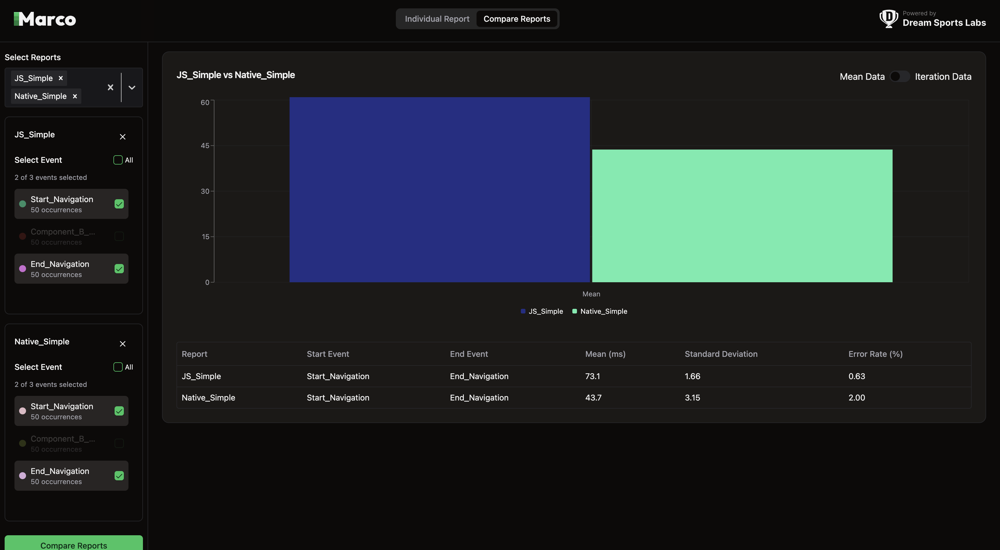
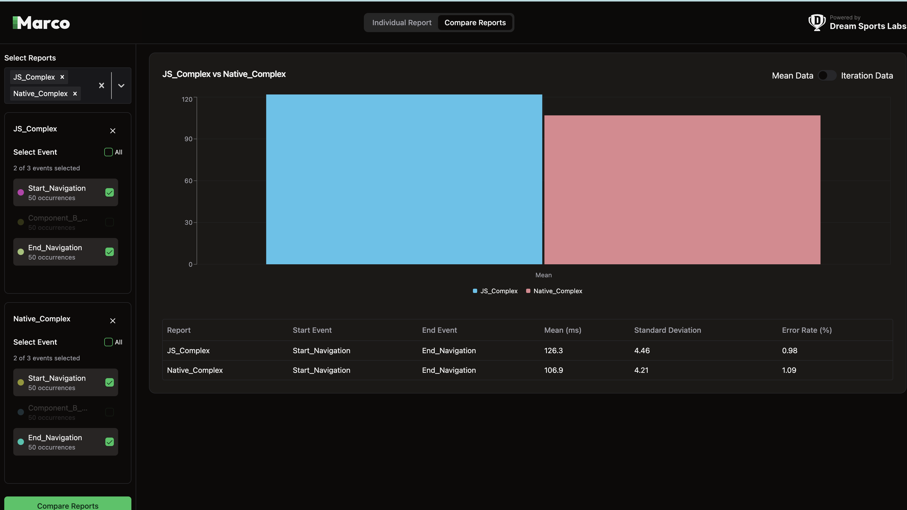

# React Navigation Benchmark

This repository contains benchmarks comparing **`@react-navigation/stack`** (JavaScript-based Stack Navigator) vs **`@react-navigation/native-stack`** (native navigation powered by `react-native-screens`) using the [Marco benchmark tool](https://github.com/dream-sports-labs/marco).

We have measured navigation performance from **Screen A** to **Screen B** under various screen complexities.

---

## 📊 Benchmark Details

### Objective

To evaluate and compare the **navigation performance** of:

- **`@react-navigation/native-stack`** – Native stack navigation
- **`@react-navigation/stack`** – JavaScript-based stack navigation

by measuring the **time taken to navigate from one screen to another** (Screen A ➡️ Screen B).

---

### 📍 How is it measured?

We instrumented the navigation flow using **Marco Markers** with the following timestamps:

- **T0(Start_Navigation):** Time when the navigation button is pressed on **Screen A**
- **T1(End_Navigation):** Time when the first render of **Screen B** component completes

The navigation duration is calculated as:  
**Navigation Time = T1 - T0**

---

## 📂 Benchmark Scenarios

We tested the navigation stacks under different conditions:

| Report Name    | Description                                                     |
|----------------|-----------------------------------------------------------------|
| JS_Simple      | JS Stack (`@react-navigation/stack`) - Simple Screen            |
| Native_Simple  | Native Stack (`@react-navigation/native-stack`) - Simple Screen |
| JS_Complex     | JS Stack - Complex Screen                                       |
| Native_Complex | Native Stack - Complex Screen                                   |

All benchmarks were run on **low-end Android device**.

---

### 📊 Android Benchmark Results (Simple Screens)



---

### 📊 Android Benchmark Results (Complex Screens)



---

## 📦 Setup Instructions
> **Note**: Make sure you have completed the [Set Up Your Environment](https://reactnative.dev/docs/set-up-your-environment) guide before proceeding.

### Step 1: Clone project and Install Dependencies

```sh
git clone https://github.com/dream-sports-labs/react-navigation-benchmark.git
cd NavigationBenchmark
yarn install
```

### Step 2: Start Metro

Run the Metro dev server:

```sh
# Using npm
npm start

# OR using Yarn
yarn start
```

### Step 2: Build and Run Your App

Open a new terminal and run:

#### Android

```sh
npm run android
# OR
yarn android
```

#### iOS

First install CocoaPods (only once):

```sh
bundle install
bundle exec pod install
```

Then run the app:

```sh
npm run ios
# OR
yarn ios
```

### Step 3: Modify and Refresh

Modify `App.tsx`.
Use `useNativeNavigation` flag to switch between js stack navigation and navtive stack navigation.

## 📌 Run Benchmark with Maestro
We are using the Marco tool to mark events and CLI tools provided by Marco to visualize the results.
For more details refer: [Marco Documentation](https://marco.dreamsportslabs.com/)
We use [Maestro](https://maestro.mobile.dev/) for scripting navigation interactions.

### 1. Check Maestro Installation

```sh
maestro -v
```

### 2. Run Benchmark Test Scripts

#### Android

```sh
# JS Stack
maestro test .maestro/tests/AndroidScript/navigation-benchmark-js.yml

# Native Stack
maestro test .maestro/tests/AndroidScript/navigation-benchmark-native.yml
```

#### iOS

```sh
# JS Stack
maestro test .maestro/tests/iosScript/navigation-benchmark-js.yml

# Native Stack
maestro test .maestro/tests/iosScript/navigation-benchmark-native.yml
```

---

## 📊 Generate and Visualize Reports
### Generate Reports

```sh
yarn marco generate --platform android
yarn marco generate --platform ios
```
> 📁 Reports will be saved in:
> - `marco-reports/android/`
> - `marco-reports/ios/`


### Visualize Reports
> 🛠️ Before visualization, ensure correct `path` and `reportName` are set in `marco.config.js`.
```sh
yarn marco visualize --platform android
yarn marco visualize --platform ios
```

---
